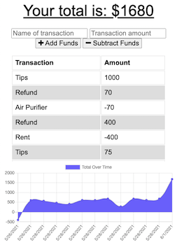

# Budget-Tracker-PWA

Use the budget tracker to meet your financial goals from anywhere - on or offline

## Table of Contents

- [Description](#description)
- [Visuals](#visuals)
- [Technologies](#technologies)
- [Contributions](#contributions)
- [Contact Me](#questions)
- [License](#license)

## Description

With the budget tracker, you're able to add expenses and depsits to your budget with or without an internet connection. All offline transactions are stored in your local cache, and added to the database when you come back online - removes the need to worry about losing any transactions while traveling or just out and about.

## Visuals

[Heroku Deployment](https://desolate-harbor-24353.herokuapp.com)

## Technologies

- MongoDB
- IndexedDB
- Express
- NodeJS

## Contributions

Sole Author of offline functionality: k.wilkinson

This project was completed as an individual assignment for The Ohio State University Coding Boot Camp.

## Questions?

Please feel free to contact with any questions via email or LinkedIn.

- Github: [NAHco-code](https://github.com/NAHco-code)
- LinkedIn: [kwilkinsonxx](https://www.linkedin.com/in/kwilkinsonxx/)
- Email: [kathrynxwilk@gmail.com](kathrynxwilk@gmail.com)

## License

This project is licensed under the MIT License.
For more information, please visit: [MIT Explained](https://choosealicense.com/licenses/mit/)

&copy; 2021 k.wilkinson
